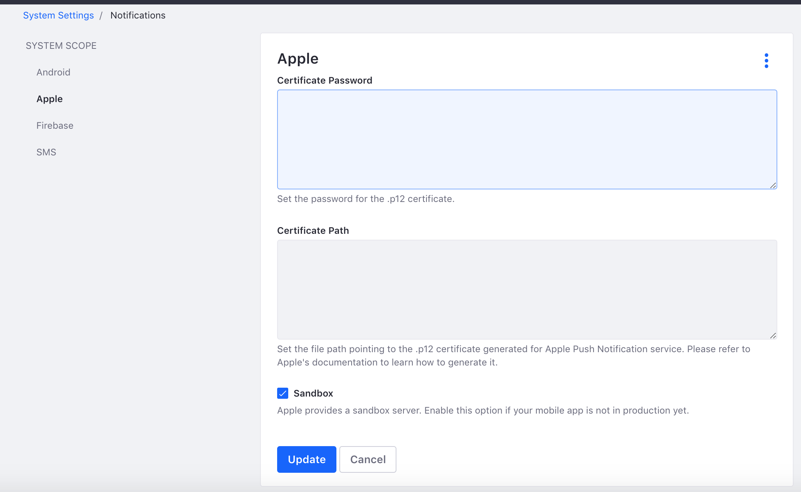
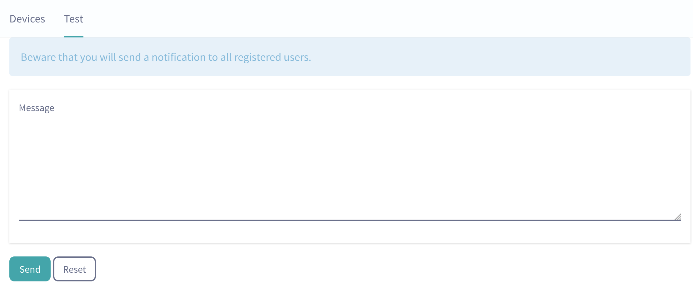

# Liferay Push for iOS

[](https://travis-ci.org/brunofarache/liferay-push-ios)

* [Setup](#setup)
* [Use](#use)
	* [Configuring Server](#configuring-the-server-to-send-push-notifications)
	* [Registering device](#registering-a-device)
	* [Sending push notifications](#sending-push-notifications)
	* [Unregistering device](#unregistering-a-device)

## Setup

Add the library pod to your application's Podfile

```
target '<your-application>' do
  use_frameworks!
  
  pod 'Liferay-Push'  
  
  // Other pods
end

```

## Sample application

Together with the library, in this repo you have a [sample](./Sample) where you can see an example on how to use this library.


## Use

### Configuring the server to send Push Notifications

First of all you need to configure your server to be able to send push notifications.

#### Generating iOS APN certificate

* Go to your [apple developer account](https://developer.apple.com/account)

* Create a new certificato for you application (giving App name, bundle ID) and select Push notifications. To do this you will have to create a cerficate request with Keychain application.
* Donwload the generated .cert and install it in your Keychain.
* Export the certicate to a .p12 file using the same App.

#### Installing the certificate in the server

Once you have the .p12 file, the next step will be putting this certificate into the server. First, you have to save the certificate in the computer where the server is running.

##### 7.1
After doing this, log into the server with a browser and go to `Control Panel` -> `Configuration` -> `System Settings` -> `Notifications` and select the `Apple` System Scope.

You will see a screen similar to this:



##### 7.0
After doing this, log into the server with a browser and go to `Configuration` -> `System Settings` and look for `Apple Push Notification Sender`.

You will see a screen similar to this:


* In the first field, you have to add the password that you set when you exported the certificate.
* In the second field, you have to add the path where the certificate is located.
* The last field it's a checkbox, you have to enable it when you are using a development certificate.


### Configuring application to receive Push notifications

#### Enabling Push notifications in the application

For your application to be ready to receive push notifications you need to enable the following capabilities:

 * Background modes -> Remote notifications.
 * Push notifications.

#### Registering the device token

To receive push notifications, your app must register itself to the portal first. On the portal side, each device is tied to a user. Each user can have multiple registered devices. A device is represented by a device token string


### Registering a Device

To receive push notifications, your app must register itself to the portal first. On the portal side, each device is tied to a user. Each user can have multiple registered devices. A device is represented by a device token string.

Read [Apple's documentation](https://developer.apple.com/library/content/documentation/NetworkingInternet/Conceptual/RemoteNotificationsPG/HandlingRemoteNotifications.html#//apple_ref/doc/uid/TP40008194-CH6-SW1) to learn how to get the device token. This [tutorial](https://www.raywenderlich.com/156966/push-notifications-tutorial-getting-started) is also useful to learn how Apple Push Notification works.

Once you have the device token, you can register the device to the portal by calling:

```objective-c
#import "Push.h"

LRSession *session = [[LRSession alloc] initWithServer:@"http://localhost:8080" username:@"test@liferay.com" password:@"test"];

[[Push withSession:session] registerTokenData:deviceToken];
```

```swift
import LRPush

LRPush.withSession(session)
	.registerDeviceTokenData(deviceToken)

```

Now each time the portal wants to send a push notification to the user `test@liferay.com`, it looks up all registered devices for the user (including the one just registered) and sends the push notification for each `deviceToken` found.

Since all operations are asynchronous, you can set callbacks to check if the registration succeeded or an error occurred on the server side:

```objective-c
[[[[Push withSession:self.session]
	onSuccess:^(NSDictionary *device) {
		NSLog(@"Device was registered!");
	}]
	onFailure:^(NSError *e) {
		NSLog(@"Some error occurred!");
	}]
	registerTokenData:deviceToken];
```

```swift
import LRPush

LRPush.withSession(session)
	.withPortalVersion(70)
	.onSuccess {
		print("Success: \(String(describing: $0))")
	}
	.onFailure {
		print("Error \(String(describing: $0))")
	}
	.registerDeviceTokenData(deviceToken)

```

The `onSuccess` and `onFailure` blocks are optional, but it's good practice to implement both. By doing your app can persist the device token or tell the user that an error ocurred.

Once your device is registered, your app must be able to listen for notifications. [Apple's developer documentation](https://developer.apple.com/library/content/documentation/NetworkingInternet/Conceptual/RemoteNotificationsPG/SupportingNotificationsinYourApp.html#//apple_ref/doc/uid/TP40008194-CH4-SW14) shows how to implement this in your app.

### Sending Push Notifications

There are many ways to send push notifications from Liferay Portal. See the [Liferay Push documentation](../README.md) for more details. Alternatively, you can send push notifications from your iOS app. Just make sure the user has the proper permissions in the portal to send push notifications.

```objective-c
NSDictionary notification = @{
    @"body": @"hello!"
};

[[Push withSession:session] sendToUserId:123 notification:notification];
```

```swift
let notification: [String: AnyObject] = [
	"body": "hello!" as AnyObject
]

Push.withSession(session).sendToUserId(123, notification:notification)
```

In this code, the push notification is sent to the user specified by `sendToUserId`. Upon receiving the notification, the portal looks up all the user's registered devices (both Android and iOS devices) and sends `notification` as the body of the push notification.

### Unregistering a Device

If you want to stop receiving push notifications on a device, you can unregister it from from the portal with the following code:

```objective-c
[[Push withSession:session] unregisterToken:deviceToken];
```

```swift
Push.withSession(session).unregisterToken(deviceToken)
```
    
Users can only unregister devices they own.

### Testing push notifications

Liferay has a portlet prepared to perform test sending push notifications. After log in into the portal you have go to Configuration -> Push notifications. You will see a screen like this:



If you want to send a push notification in order to test them. You have to enter the content of the push notification in the message textfield. Note that it has to be a correct json like: `{"body": "push notification body"}`

**Important note**

If you want to use this method for testing you have to know that you need certain keys if you want to receive the push notifications correctly in your iOS device.
The message that you pass to the Push portlet is not the final message that is sent to the APN. Liferay push Portlet is meant to be used agnostic of the platform, so the final message follow the next constraints:

* All the values that you put in the json with a key name that is not reserved will be sent under the `payload` key in the final message. Ej: `{"myKey": "myValue"}` would be converted to `{"apn": {}, "payload": {"myKey", "myValue"}`

* Body key will be converted to alert and will be inside apn key. Ej `{"body": "my push body"}` would be converted to `{"apn": {"alert": "my push body"}}`. (adding this key is **mandatory** if you want to display a visual notification)

* Silent key with true value will be converted to content-available and will be inside apn key. Ej `{"silent": true}` would be converted to `{"apn": {"content-available": 1}}`. (adding this key is **mandatory** if you want to send a silent notification)

* Sound key will be inside apn key. Ej `{"sound": "default"}` would be converted to `{"apn": {"sound": "default"}}`.

* badge key will be inside apn key. Ej `{"badge": 1}` would be converted to `{"apn": {"badge": 1}}`. (adding this key is **mandatory** if you want to send a silent notification)


